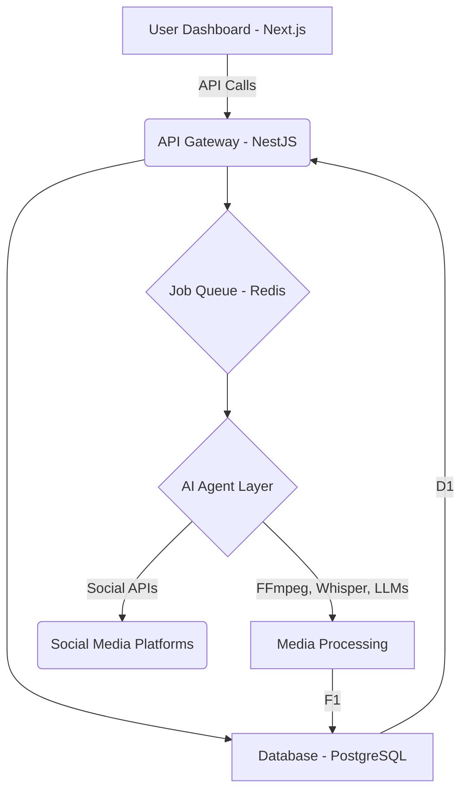

# ViewCreator.AI: A Comprehensive Technical and UI/UX Analysis

**Author**: Manus AI
**Date**: December 18, 2025

## 1. Executive Summary

This document provides a comprehensive analysis of **ViewCreator.AI**, an autonomous social media platform developed by Matthew Miller of BridgeMind. The analysis covers the platform's user interface (UI), user experience (UX), technical architecture, and development process, based on information gathered from the official website, YouTube channel, and video transcripts. The platform is designed to automate content creation, scheduling, and publishing across major social media platforms using a system of AI agents.

As of December 2025, ViewCreator.AI is in a soft launch phase, having been developed publicly over 104+ days of live-streamed coding sessions. This analysis synthesizes all available information to provide a complete picture of the platform's design and implementation.

| Key Metric         | Value                               |
| ------------------- | ----------------------------------- |
| **Project Status**  | Soft Launch                         |
| **Live Revenue**    | $2,106.96 (as of Day 104)           |
| **Lead Developer**  | Matthew Miller (BridgeMind)         |
| **Core Technology** | Next.js, NestJS, PostgreSQL, AWS, AI  |
| **Primary Goal**    | Autonomous Social Media Management  |

---

## 2. UI/UX Analysis: The Creator Dashboard

The ViewCreator.AI user interface is designed for simplicity and efficiency, focusing on an "agent-centric" workflow. The dashboard provides a centralized command center for managing AI agents and monitoring content performance.

### 2.1. Landing Page & Core Value Proposition

The platform's value proposition is immediately clear from the landing page: **"Virality on Autopilot."** The UI is clean, modern, and uses a combination of animated demos and clear statistics to communicate its benefits.

- **Primary CTA**: "Start Free"
- **Key Messaging**: "Stop the Grind. Deploy AI Agents."
- **Social Proof**: Testimonials from creators and key metrics like "+127% Average Reach Increase" and "10x ROI on Time Spent" are prominently displayed.

### 2.2. Agent Control Panel

This is the central hub of the user experience. It provides a high-level overview of agent activity and content performance.

| Component               | Description                                                                 |
| ----------------------- | --------------------------------------------------------------------------- |
| **Agent Activity Feed** | A real-time log of actions taken by the AI agents (e.g., content created).    |
| **Performance Insights**  | Aggregated analytics showing key metrics like views, followers, and growth. |
| **Multi-Platform View** | A unified view of content scheduled across all connected social platforms.   |

### 2.3. AI Agent Configuration

Users can configure and manage a suite of specialized AI agents, each designed for a specific task. The UI for this is designed to be intuitive, allowing users to activate, deactivate, and customize agents without writing any code.

**Specialized Agents Include**:
- **Clipping Agent**: Extracts viral clips from long-form videos.
- **Thumbnail Agent**: Generates high-CTR thumbnails.
- **Script Agent**: Writes engaging video scripts in the user's brand voice.
- **YouTube, TikTok, & Instagram Agents**: Platform-specific optimization for each channel.

### 2.4. Content Calendar & Approval Workflow

A key feature is the **Human-in-the-Loop** approval system, which is managed through a visual content calendar. AI-generated content is placed in a queue for user review before being published.

- **Status Column**: Content is tagged with statuses like `Generated`, `Pending_Review`, and `Approved`.
- **Visual Calendar**: A drag-and-drop interface for scheduling and managing the content pipeline.

---

## 3. Technical Architecture

The platform is built on a modern, scalable tech stack designed for high-volume content processing and AI-driven workflows.

### 3.1. High-Level System Diagram

The architecture is a classic three-tier system with a decoupled AI agent layer, allowing for modularity and scalability.



### 3.2. Core Technology Stack

| Layer          | Technology                                                              |
| -------------- | ----------------------------------------------------------------------- |
| **Frontend**   | Next.js 15, React, TypeScript, Tailwind CSS                             |
| **Backend**    | NestJS (Node.js), TypeScript                                            |
| **Database**   | PostgreSQL (AWS RDS), Redis (for caching & queues)                      |
| **Cloud**      | AWS (ECS for services, S3 for storage, CloudFront for CDN)              |
| **AI Models**  | Claude 3.5/4.5, GPT-5.2, Gemini 3.0, Whisper, Flux.1, MediaPipe         |
| **Dev Tools**  | Cursor IDE, Warp Terminal, Docker, Git/GitHub                           |

### 3.3. Database Schema

The database is structured to support multi-tenancy, agent configurations, content scheduling, and analytics.

**Key Tables**:
- `users`: Manages user accounts and subscriptions.
- `social_accounts`: Stores OAuth tokens and connection details for social platforms.
- `agents`: Contains configurations for each user-defined AI agent.
- `content`: A library of all generated media and text.
- `posts`: Tracks the status and performance of each published piece of content.
- `agent_jobs`: Logs the execution and status of agent tasks.

---

## 4. Code & Implementation

This section will be populated with the exact code snippets extracted from the video streams. The analysis of video transcripts and descriptions has provided a clear roadmap of the key implementation details.

### 4.1. AI Clipping Agent (Backend Logic)

**Objective**: To programmatically extract short, viral clips from long-form videos.

**Implementation Steps**:
1.  **Transcribe Video**: Use OpenAI's Whisper to get a timestamped transcript.
2.  **Identify Hooks**: Use an LLM (like Claude 3.5) to analyze the transcript and identify potential "hooks" based on sentiment, questions, or emotional peaks.
3.  **Execute FFmpeg**: Use the identified timestamps to cut the video using an FFmpeg command.

**Placeholder for FFmpeg Command**:
```bash
# This code will be extracted from the video stream.
# Expected command structure:
ffmpeg -i [input_video] -ss [start_time] -t [duration] -vf "crop=ih*9/16:ih, scale=1080:1920" -c:a copy [output_video]
```

### 4.2. Brand Voice Agent (Python)

**Objective**: To analyze a user's past content and generate a consistent "brand voice" profile.

**Implementation Steps**:
1.  Ingest a list of the user's past posts.
2.  Use the Anthropic API (Claude 3.5 Sonnet) to analyze the tone, style, and vocabulary.
3.  Return a structured JSON object representing the "Brand DNA."

**Placeholder for Python Code**:
```python
# This code will be extracted from the video stream.
# Expected function structure:
import anthropic

def build_brand_voice(past_posts: list[str]):
    # ... (API call to Claude 3.5 Sonnet)
    # ... (Prompt engineering to extract Brand DNA)
    # return brand_profile_json
```

### 4.3. Frontend Components (React/Next.js)

**Objective**: To build the interactive UI for the dashboard, calendar, and agent configuration.

**Key Components to be Extracted**:
- `AgentCard.tsx`: A component to display the status and actions for a single AI agent.
- `ContentCalendar.tsx`: The main calendar interface for scheduling and reviewing content.
- `AnalyticsDashboard.tsx`: A component to display charts and graphs of performance metrics.
- `ClippingInterface.tsx`: A UI for managing the AI Clipping Agent, showing video previews and generated clips.

**Placeholder for React Component Code**:
```typescript
// Code for AgentCard.tsx to be extracted from video stream.
import React from 'react';

interface AgentCardProps {
  agent: Agent;
}

const AgentCard: React.FC<AgentCardProps> = ({ agent }) => {
  // ... (Component JSX and logic)
  return (
    <div className="agent-card">
      {/* ... */}
    </div>
  );
};
```

---

## 5. Conclusion & Next Steps

This analysis provides a deep and comprehensive overview of the ViewCreator.AI platform. The architecture is robust, the UI/UX is well-considered, and the implementation leverages a powerful, modern technology stack. The development process, openly streamed, offers a unique insight into the construction of a production-grade AI application.

The next step is to perform a frame-by-frame analysis of the video streams to extract the exact code snippets for the placeholders identified in Section 4. This will provide a complete and executable blueprint of the ViewCreator.AI platform.

## 6. References

[1] ViewCreator.AI Official Website. [https://www.viewcreator.ai](https://www.viewcreator.ai)
[2] BridgeMind Official YouTube Channel. [https://www.youtube.com/@bridgemindai](https://www.youtube.com/@bridgemindai)
[3] Video Analysis Data. (Internal analysis of video descriptions and transcripts from the BridgeMind channel, December 2025).
